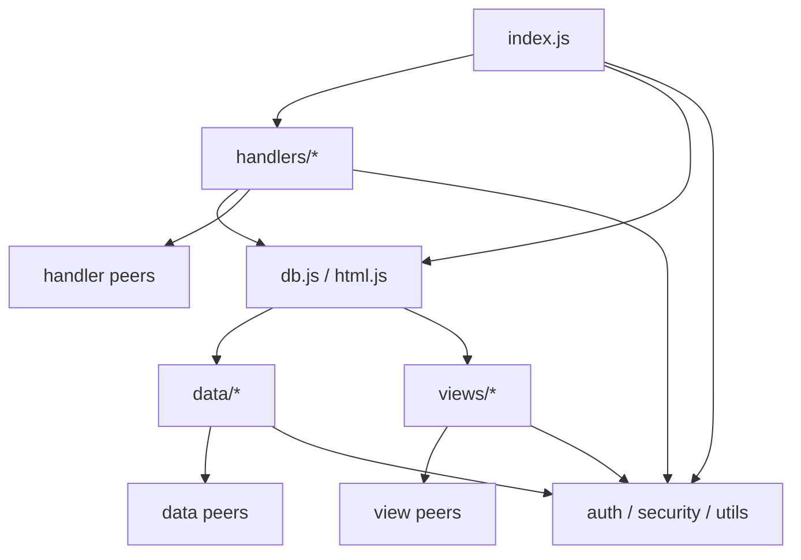

# Phase 0 리팩토링 기준상태

- 측정일: 2026-07-19 (Asia/Seoul)
- 기준 저장소: `NKH-92/hanlim-archive`
- 기준 HEAD: `aa076e44f96686994c089d51b977cef024f8c1a0`
- 작업 브랜치: `codex/refactor-phase-0-baseline`
- 범위: 런타임 동작을 바꾸지 않고 현재 행동·구조·성능·데이터 계약을 고정

## 작업 트리와 도구

측정 전 tracked 파일 변경은 없었다. 아래 untracked 항목은 기존 사용자/도구 파일이므로 이번
Phase에서 수정하거나 포함하지 않았다.

```text
.pnpm-store/
.tmp/
cloudflare-app/.tmp/
hl-archive-github-deploy.txt
```

| 도구 | 버전 |
|---|---:|
| Node.js | 24.16.0 |
| npm | 11.13.0 |
| Wrangler | 4.81.1 |
| Git for Windows | 2.54.0 |

## 기준 검증 결과

| 명령 | 결과 |
|---|---|
| `npm ci` | 성공, 34 packages 설치, 35 packages audit |
| `npm run check` | 성공, 95개 파일 문법 검사 통과 |
| `npm test` (Phase 0 산출물 추가 전) | 성공, 198/198, 실패·skip·todo 0 |
| `npm test` (search golden 포함 최종) | 성공, 200/200, 실패·skip·todo 0 |
| `node --test --experimental-test-coverage tests/*.test.js` | 성공, line 79.69%, branch 61.52%, function 80.27% |
| 격리 D1 `wrangler d1 migrations apply ... --local --persist-to ...` | 성공, 0001~0027 전체 적용 |
| 격리 D1 `PRAGMA foreign_key_check` | 결과 0행 |
| `wrangler deploy --dry-run` | 성공 |

`npm ci`/`npm audit`는 잠금파일의 개발 도구 체인에서 취약점 5건(낮음 1, 높음 4)을
보고했다. 직접 의존성 `wrangler`와 전이 의존성 `esbuild`, `miniflare`, `undici`, `ws`에
수정 가능 버전이 있다. Phase 0은 기준 고정 단계이므로 잠금파일과 런타임을 변경하지 않았다.

## Schema 기준

- migration: 27개, `0001`부터 `0027`까지 번호 중복·누락 없음
- 애플리케이션 테이블: 22개
- D1 관리 테이블: `d1_migrations` 1개
- 감사·이력 불변 trigger: 9개
- 외래키 검사: 위반 0건

전체 목록과 mutation 불변식은
[`docs/validation/DATA_INTEGRITY_INVARIANTS.md`](../validation/DATA_INTEGRITY_INVARIANTS.md)에 고정한다.

## 공개 모듈 계약

| 모듈 | 현재 공개 표면 |
|---|---:|
| `src/index.js` | named export 없음, default 객체의 `fetch` 1개 |
| `src/db.js` | 117 exports |
| `src/html.js` | 39 exports |

정확한 export 이름은 `tests/publicArchitectureContracts.test.js`가 고정한다. 리팩토링 중 façade를
유지하는 동안 이 수와 이름을 임의로 줄이거나 늘리지 않는다.

## Import graph 기준

`src/**/*.js`의 정적 상대 import/export-from을 측정했다.

- source module: 94개
- directed import edge: 286개
- architecture contract 위반: 0개



| edge group | 수 |
|---|---:|
| index → handlers / façade / leaf | 2 / 1 / 3 |
| handlers → handlers / façade / leaf | 37 / 32 / 35 |
| façade → data / views | 13 / 14 |
| data → data / leaf | 26 / 26 |
| views → views / leaf | 51 / 31 |
| leaf → leaf | 15 |

outgoing edge가 많은 조립 지점은 `handlers/authenticatedRouter.js`(14), `html.js`(14),
`db.js`(13), `views/styles.js`(9) 순이다. Phase 0에서는 이 graph를 바꾸지 않는다.

## Route와 permission 기준

- 현재 route/method/dispatcher 우선순위: [`docs/ROUTE_CATALOG.md`](../ROUTE_CATALOG.md)
- 역할·권한·직접 URL 판정: [`docs/PERMISSION_MATRIX.md`](../PERMISSION_MATRIX.md)
- 현재 method mismatch는 명시적 405가 아니라 최종 404다.
- 신뢰하지 않은 POST는 route 판정보다 먼저 403이다.
- 인증 POST의 CSRF 실패도 최종 404보다 먼저 403이다.
- 공개 `/signup`은 method와 무관하게 404다.

## Critical D1 mutation 기준

내부 한도는 요청당 40 statements다. 핵심 batch 순서와 guard는
`tests/criticalMutationContracts.test.js`, `tests/dataIntegrityRefactor.test.js`,
`tests/db.test.js`, `tests/phase34Jobs.test.js`가 고정한다.

| mutation | batch statements | 별도 D1 read 포함 기준 |
|---|---:|---:|
| 문서 생성 | `3 + unique tag 수` (fixture 5) | 동일 |
| 문서 수정 | `3 + unique tag 수` | 사전 조회 별도 |
| 문서 폐기 / 복구 | 3 / 4 | 문서·태그 조회 별도 |
| 소량 일괄 폐기 | `3 × active 문서 수`, 최대 30 | 최대 32 |
| 문서 영구삭제 | 3 | 문서·태그·폐기이력 조회 별도 |
| 문서 위치 이동 | 4 | 문서·대상 위치 조회 별도 |
| 세트 생성·수정 | 2 | 수정 충돌 시 확인 조회 가능 |
| 세트 삭제 / 추가 / 제외 / 잠금 | 3 / 3 / 3 / 3 | 대상 조회 별도 |
| 카테고리·태그 생성·수정·비활성 | 2 | 수정·비활성 사전 조회 별도 |
| 사용자 상태·권한 변경 | 2 | 사용자 조회 별도 |
| 랙 생성 / 수정 / 구역 구성 | 3 / 4 / 4 | 수정 2회, 구성 2회 사전 조회 |
| 폐기 캠페인 생성 / 선택 생성 | 3 / 4 | 선택 생성은 후보 조회 1회 |
| 폐기 동결 / 항목 제외·포함 / 처리 | 3 / 3 / 8 | 처리 총 9 |
| CSV 작업 생성 / active 행 처리 | 4 / 8 | 처리 총 9 |
| CSV disposed 행 처리 | 11 | 처리 총 12 |

`processDisposalBatch`는 10 이하, 모든 경로는 40 이하를 코드와 테스트에서 방어한다.

## Worker bundle과 HTML 크기

`wrangler deploy --dry-run` 기준:

| 항목 | 크기 |
|---|---:|
| Worker total upload | 586.02 KiB |
| Worker gzip | 119.81 KiB |
| static asset | 2 files |

대표 HTML은 동일 fixture를 서버 view 함수에 전달한 UTF-8 response body 크기다. CSP nonce는
매 응답 달라지지만 길이는 고정이다.

| 화면 | bytes |
|---|---:|
| 로그인 | 94,733 |
| 검색 홈 | 125,188 |
| 문서 목록 1행 | 103,487 |
| 문서 상세 1건 | 107,804 |
| 문서고 도면 1구역 | 101,561 |
| 관리자 대시보드 | 102,805 |
| 폐기 캠페인 상세 | 105,257 |

향후 CSS/JS asset 분리 작업은 이 수치와 dry-run bundle diff를 함께 비교한다.

## Search golden 기준

`tests/fixtures/search-golden.json`은 문서번호 정확·부분 일치, 한글 오타, 초성, 한/영 자판,
물리 위치, 내부 `ARC-*` 비검색을 고정한다. `tests/searchGoldenBaseline.test.js`가 현재 score,
reason, tie-break order, query filter parsing을 정확 비교한다.

## 현재 행위 보존 범위

- URL, redirect, status, toast와 dispatcher 우선순위
- Admin 하위 호환과 7개 세부 권한
- 매 요청 사용자 상태 재조회, disabled 즉시 무효, 최초 비밀번호 변경 강제
- CSP nonce, CSRF, Origin 검사와 원시 오류 비노출
- 검색 점수·후보 정렬·브라우저 직렬화, 내부 보관코드 비노출
- D1 batch 문장 순서·pre-state guard·감사 선행·낙관적 잠금
- append-only migration, 감사·이력 불변 trigger
- 7×6 랙, 단면/양면 표기와 mirror 규칙

## 위험과 Deferred issues

1. `npm audit`의 개발 도구 체인 취약점은 Phase 1에서 Wrangler/pin 변경 영향과 dry-run diff를
   확인한 뒤 별도 PR로 처리한다.
2. 고정 bootstrap 자격증명과 운영 접근통제 확인은 계획서의 Phase -1이며 운영자 승인 없이
   코드·secret·기존 migration을 바꾸지 않는다.
3. coverage가 낮은 mutation 영역(`mastersData`, `setsData`, disposal/import handler)은 구조 이동
   전에 해당 Phase에서 characterization을 추가한다. 전체 floor는 line 79.69%, branch 61.52%,
   function 80.27% 아래로 낮추지 않는다.
4. route catalog는 현재 imperative dispatcher의 증빙이다. 선언형 registry 도입은 Phase 3에서만 한다.

## 롤백

이번 Phase는 문서, fixture, characterization test만 추가한다. 해당 파일을 revert하면 런타임과
schema에 영향 없이 원복된다.

## 다음 Phase 전 결정

- Phase -1 운영 점검을 별도 변경승인 흐름으로 먼저 수행할지 결정한다.
- Phase 1에서 Node test coverage floor를 바로 required check로 둘지, 1회 관찰 기간 후 고정할지 결정한다.
- 다음 Phase는 사용자 지시 없이 시작하지 않는다.
